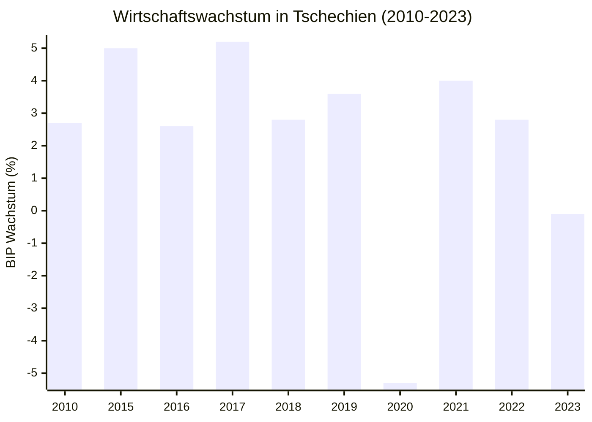

# Einzelarbeit

Aufgabenstellung:

> Du bist Experte für das dir zugeteilte EU-Land (Tschechien). Erstelle dazu einen Steckbrief (Vorlage und mögliche Recherchequellen siehe S. 324 im Buch).

### Seite 324 im Buch

# A - Allgemeines

## 1. Hauptstadt des Landes

- **Prag** seit 1. Januar **1993**

## 2. Lage in Europa, Nachbarstaaten

- **Lage**: **Mitteleuropa**
- **Grenzt** an **Deutschland**, **Polen**, **Österreich** und die **Slowakei**

## 3. Einwohnerzahl

- Schätzung 2024: ~**10.9 Millionen**

## 4. Sprache(n) und Religion(en)

- **Amtssprache**: Tschechisch
      <!-- - **Religion**:
           - 56.9% **ohne Religionszugehörigkeit**
           - 11.7% **Christentum**
           - 1.2% **weitere Religionen**
           - 30.2% **keine Angabe** -->

| Anteil | Religion                    |
| ------ | --------------------------- |
| 56.9%  | ohne Religionszugehörigkeit |
| 11.7%  | Christentum                 |
| 1.2%   | weitere Religionen          |
| 30.2%  | keine Angabe                |

## 5. Landesflagge

- Farben: **Blau**, **Weiß**, **Rot**
- In Gebrauch seit: 1. Januar **1993**

## 6. Angaben zur Geschichte des Landes

### 800-830 n. Chr.

- Entstehung des **Mährerreich** durch **Mojmir I.**

### 907. n. Chr.

- **Zerfall des Mährerreichs** durch Tod von **Svatopluk I.** (derzeitiger Herrscher)

### 1002-1035 n. Chr.

- **Böhmen** wird von **Boleslav I.** zum Königreich erhoben.

### 1306 n. Chr.

- **Wenzel III.** (derzeitiger Herrscher) stirbt, Ende der **Prager Dynastie**

### 1526 n. Chr.

- **Habsburger** besteigen den böhmischen Thron.

### 1618-1648 n. Chr.

- **Dreißigjähriger Krieg**: Böhmen wird von den Habsburgern besiegt und verliert seine Unabhängigkeit

### 1914-1918 n. Chr.

- **Erster Weltkrieg**: Tschechien kämpft auf der Seite der Mittelmächte
- Nach Krieg:
     - Gründung der **Tschechoslowakei**
     - **Beitritt** der Karpatoukraine (1919)
     - **Anschluss** von **Teschen** (1920)

### 1938-1939 n. Chr.

- **Münchner Abkommen**: Tschechoslowakei verliert das Sudetenland an Deutschland

### 1945 n. Chr.

- **Zweiter Weltkrieg**: Tschechoslowakei wird von der Sowjetunion befreit
- **Wiederherstellung** der Tschechoslowakei durch **Kaschauer Programm**

### 1948 n. Chr.

- **Machtübernahme** der Kommunisten in der Tschechoslowakei

### 1968 n. Chr.

- **Prager Frühling**: Reformbewegung in der Tschechoslowakei, die von der Sowjetunion niedergeschlagen wird

### 1989 n. Chr.

- **Samtene Revolution**: Ende der kommunistischen Herrschaft in der Tschechoslowakei

### 1993 n. Chr.

- **Teilung der Tschechoslowakei** in die **Tschechische Republik** und die **Slowakische Republik**
- Heutige **Landesflagge** wird eingeführt

### 2004 n. Chr.

- **Beitritt** zur **Europäischen Union** am 1. Mai (77.33% Zustimmung in Volksabstimmung)

## 7. Besondere Sehenswürdigkeiten

- **Prager Burg**: Größte zusammenhängende Burganlage der Welt
- **Altstädter Ring**: Historischer Marktplatz in Prag
- **Karlsbrücke**: Historische Steinbrücke in Prag
- **Český Krumlov**: Malerische Stadt mit Renaissance- und Barockarchitektur
- **Kutná Hora**: Historische Stadt mit der berühmten **Sedletzer Knochenkirche**
- **Böhmische Schweiz**: Nationalpark mit beeindruckenden Sandsteinformationen

## 8. Tourismus

- Tschechien ist das **fünftbeliebteste Reiseziel** in Europa
- Über **110,000 Angestellte** im Tourismusbereich
- Hohe **Einnahmen** durch Tourismus: **292 Milliarden CZK** <-> **11.7 Milliarden Euro**, **7.4%** des BIP (2022)

# B - Politik

## 9. Mitglied der EU, der Europäischen Währungsunion seit ...

- **EU-Mitglied** seit 1. Mai 2004
- **Euro**: Noch nicht eingeführt, **Tschechische Krone** (CZK) ist die offizielle Währung (1 Euro = 24.93 CZK (Stand: Mai 2025))

## 10. Staatsform

- **Parlamentarische Republik**
     - _parlamentarisch -> Parlament hat die legislative Gewalt_
     - _Republik -> Staatsoberhaupt ist ein Präsident, der nicht Monarch ist_

## 11. Regierungschef\*in

- **Petr Fiala** (seit 28. November 2021)
     - Vorsitzender der **Bürgerdemokratischen Partei** (ODS, vergleichbar mit Union in Deutschland)

## 12. Staatsoberhaupt

- **Petr Pavel** (seit 9. März 2023)
     - Ehemaliger General und Vorsitzender des NATO-Militärausschusses

## 13. Parlament, Zahl der Parlamentssitze, Wahlen

- **Parlament**: **Zweikammerparlament**
     - **Abgeordnetenhaus** (Poslanecká sněmovna): 200 Sitze
     - **Senat** (Senát): 81 Sitze
- **Wahlen**:
     - **Abgeordnetenhaus**: Alle 4 Jahre, Verhältniswahlrecht
     - **Senat**: Alle 6 Jahre, 1/3 der Sitze alle 2 Jahre, Mehrheitswahlrecht

# C - Wirtschaft

## 14. Pro-Kopf-Einkommen

- **Pro-Kopf-Einkommen**: ~**27,830 Euro** (2023)
- **Pro-Kopf-Einkommen** in DE: ~**53,565 Euro** (2023)

## 15. Arbeitslosenquote

- **Arbeitslosenquote**: ~**2.68%** (Jan 2025)
- **Arbeitslosenquote Deutschland**: ~**2.1%** (Mai 2025)

## 16. Inflationsrate

- **Inflationsrate**: ~**2.2%** (2024)
- **Inflationsrate Deutschland**: ~**2.1%** (April 2025)

## 17. Wirtschaftswachstum

- **Wirtschaftswachstum**: ~**-0.1%** (2023)

## 18. Besondere Leistungen und Probleme

- **Leistungen**:
     - Starke **Industrie**: Maschinenbau, Automobilindustrie, Elektronik
     - Hohe **Bildungsstandards** und gut ausgebildete Arbeitskräfte
     - **Tourismus** als wichtiger Wirtschaftszweig
- **Probleme**:
     - **Demografischer Wandel**: Alternde Bevölkerung, niedrige Geburtenrate
     - **Abhängigkeit von Exporten**: Hohe Abhängigkeit von der Automobilindustrie und anderen Exportbranchen
     - **Korruption**: Politische Korruption und Misswirtschaft in einigen Bereichen