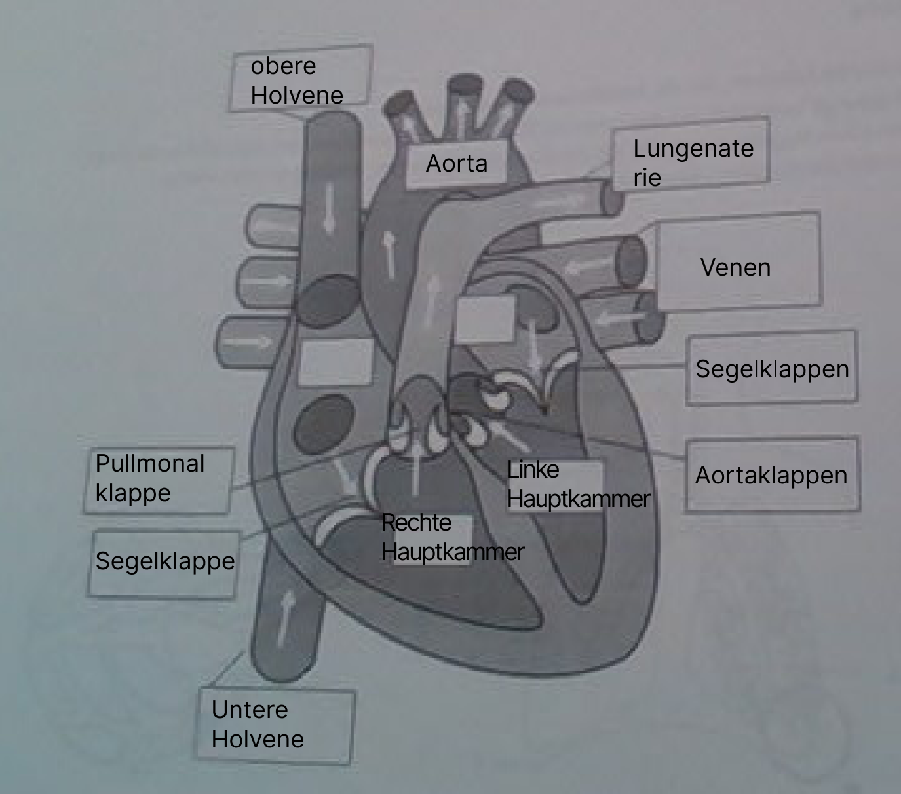

# EG - Atmung

| Aufgabe                                                                             | Lösung                                                                                                                                                                                |
| ----------------------------------------------------------------------------------- | ------------------------------------------------------------------------------------------------------------------------------------------------------------------------------------- |
| Beschreibe Faktoren, die die Atemfrequenz beeinflussen                              | **Körperliche Aktivität**, **Alter**, **Fitness**, **Emotionen**, **Fieber**, **Krankheiten** (z.B. Asthma), **Medikamente** und die $CO_2$-Konzentration im Blut.                    |
| Wie gelangt Sauerstoff aus der Lunge ins Blut und $CO_2$ aus dem Blut in die Lunge? | Sauerstoff gelangt durch die Alveolen in die Kapillaren und wird von roten Blutkörperchen transportiert. $CO_2$ wird in den Alveolen zwischengespeichert und beim Ausatmen abgegeben. |
| Bennene die einzelnen Bestadteile des Atemapperats                                  | 1. **Nasenhöhle**   2. **Rachenraum**   3. **Kehlkopf**   4. **Luftröhre**   5. **Bronchien**   6. **Lungenbläschen**   7. **Zwerchfell**                           |

### Stelle einen Regelkreis dar, der die Zusammenhänge bei der Atmung deutlich macht

# EG - Blutdruck und Puls

| Aufgabe                                                                | Lösung                                                                                                                                                                                                                                                                            |
| ---------------------------------------------------------------------- | --------------------------------------------------------------------------------------------------------------------------------------------------------------------------------------------------------------------------------------------------------------------------------- |
| Was versteht man unter systolischem und diastolischem Blutdruck?       | **Systolischer Blutdruckwert**: Maximalwert der im Blutkreislauf bei der Messung gemessen wird, Zeitpunkt bei dem das Herz pumpt.   **Diastolischer Blutdruckwert**: Minimalwert der im Blutkreislauf bei der Messung gemessen wird, Zeitpunkt bei dem das Herz entspannt ist. |
| Nenne Faktoren, die die Höhe des Blutdrucks beeinflussen               | 1. Stärke der **Herzaktivität**   2. **Durchmesser** der **Blutgefäße**   3. Körperliche **Anstrengung**                                                                                                                                                                    |
| Welchen Einfluss hat das vegetative Nervensystem auf die Herztätigkeit | Das **vegetative Nervensystem** aktiviert das **Herz** bei **erhöhter** **Anstrengung** => Dadurch schlägt es **schneller** und **verstärkt** die **Schlagkraft**. Bei **vergangenem Bedarf** zurück zu **Normalzustand**                                                         |

### Erstelle jweils einen Regelkreis, der die Änderung des Blutdrucks und der Herzfrequenz beschreibt

#### Blutdruck

#### Herzfrequenz

# EG - EKG

### Beschriftung Herz

| Aufgabe                                        | Lösung |
| ---------------------------------------------- | ------ |
| Beschreibe den Weg des Blutes durch den Körper | 
| Was ist Adrenalin und welche Bedeutung hat es? |

# EG - Hautwiderstand

| Aufgabe                                                                                            | Lösung                                                                                                                                                                                                                                                      |
| -------------------------------------------------------------------------------------------------- | ----------------------------------------------------------------------------------------------------------------------------------------------------------------------------------------------------------------------------------------------------------- |
| Fasse die verschiedenen Aufgaben der Haut zusammen                                                 | **Lederhaut**: Enthalten **Rezeptoren** für **Drucksinn**, **Tastsinn**, **Temperatursinn** und **Schmerzsinn**   **Regulierung** der **Körpertemperatur** durch Ausstoß von **Schweiß** (=> Wasserkühlung)                                           |
| Beschreibe die Zusammensetzung des Schweißes, sowie seinen Einfluss auf die Leitfähigkeit der Haut | 99% **Wasser**   1% **Salze** (hauptsächlich **Natriumchlorid** $NaCL$ und **Harnstoff** $CH_4N_2O$)   **Schweiß** zeigt zudem eine **schwache Saure** Reaktion   Elektrische **Leitfähigkeit steigt** mit **Schweißmenge** aufgrund der **Salze** |
