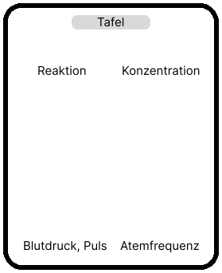

# Layout (206 oder 218)

# Zeitablauf

| Aktivität           |     Zeit | Anzahl   Gleichzeitig | Anzahl   Durchläufe |
| ------------------- | -------: | ------------------------ | ---------------------- |
| Atemfrequenz        | **120s** | 1                        | 2                      |
| Blutdruck   Puls | **120s** | 1                        | 2                      |
| Konzentration       | **240s** | 2                        | 2                      |
| Reaktion            | **120s** | 2                        | 2                      |

## Beispiel: Ablauf einer Person

- 2x **120s** Atemfrequenz
- 2x **120s** Blutdruck und Puls
- 2x **240s** Konzentration
- 2x **120s** Reaktion

Gesamt: **1200s** = **20min**

# Material

## Atemfrequenz

| Material   | Anzahl |
| ---------- | -----: |
| Lab Pro    |      1 |
| Spirometer |      1 |
| Laptop     |      2 |

## Blutdruck und Puls

| Material           | Anzahl |
| ------------------ | -----: |
| Blutdruckmessgerät |      1 |

## Reaktion und Konzentration

| Material                | Anzahl |
| ----------------------- | -----: |
| Laptop (mit Internet)   |      2 |
| Mehrfachsteckdose (+3x) |      1 |
| Kopfhörer               |      2 |
| Kopfhörer (backup)      |      1 |

## Sonstiges

| Material        | Anzahl |
| --------------- | -----: |
| Laptop (backup) |      1 |
