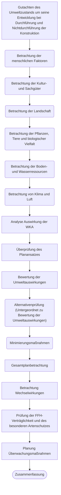

# 3. Schematische Darstellung der Suche nach geeigneten Gebieten

# 4. Welche rechtlichen Rahmenbedingungen spielen eine zentrale Rolle bei der Standortsuche?

- EU-Richtlinien zu Naturschutz
- Planerische Festlegungen zu Siedlungs- und Infrastrukturentwicklung
- Deutsches Artenschutzgesetz