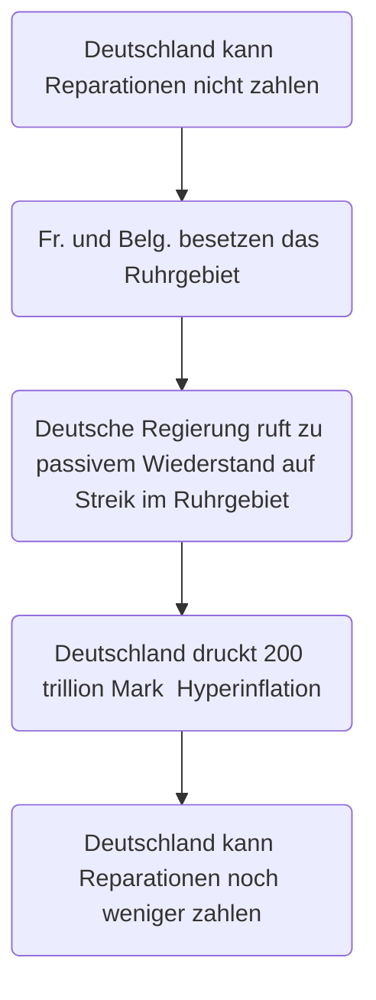

# Versailler Vertrag

## 1. Einleitung

- **Friedensvertrag nach dem 1. Weltkrieg**
- Schuld am Krieg wurde **nur** Deutschland und seinen Verbündeten zugeschrieben
- **Beschlossen von den Siegermächten** (USA, Großbritannien, Frankreich, Italien)
- **Deutschland war verpflichtet**, den Vertrag zu unterschreiben

## 2. Inhalt

### 2.1. Artikel 231 (Kriegsschuldartikel)

- **Deutschland und seine Verbündeten** tragen die **alleinige Verantwortung** für den Krieg
- **Deutschland muss für alle Kriegsschäden aufkommen** (Reparationen im Wert von 132 Milliarden Goldmark)

### 2.2. Territoriale Bestimmungen

- **Deutschland musste Gebiete abtreten** (z.B. Elsaß-Lothringen an Frankreich, Nordschleswig an Dänemark, Westpreußen und Posen an Polen)
- **Deutschland musste Kolonien abtreten** (z.B. Togo, Kamerun, Deutsch-Südwestafrika)

### 2.3. Militärische Bestimmungen

- **Deutschlands Armee wurde auf 100.000 Mann beschränkt + 4.000 Offiziere**
- Allgemeine **Wehrpflicht wurde verboten / abgeschafft**
- **Maximale Dienstzeit für Soldaten: 12 Jahre**
- **Marine wurde beschränkte**: 15.000 Mann, 6 gepanzerte Schiffe, 6 Kreuzer, 12 Zerstörer, 12 Torpedoboote
- **Deutschland durfte keine schweren Waffen besitzen** (z.B. Panzer, U-Boote, Flugzeuge, schwere Artillerie)
- **Verbot von chemischen Waffen**
- **Beschränkungen der Waffenvorräte**: 102.000 Gewehre, 40,8 Mio. Gewehrpatronen
- **Verbot des Wiederaufbaus von Luftstreitkräften**
- **Demilitarisierung des Rheinlandes** (50km breiter Streifen entlang des Rheins)
- **Verbot von Festungen entlang der deutschen Grenze**

### 2.4. Wirtschaftliche Bestimmungen

- **Deutschland musste Reparationen zahlen** (132 Milliarden Goldmark)
- **Deutschland musste Rohstoffe und Industrieprodukte an die Siegermächte liefern**
- **Deutschland musste einen Großteil seiner Handelsflotte abgeben**
- **Deutschland musste Minen abgeben** (Kohle, Eisen)
- **Deutschland musste seine Patente abgeben** (z.B. Aspirin, Dynamit)

### 2.5. Sonstige Bestimmungen

- **Deutschland musste alle seine Bündnisse kündigen**

## 3. Folgen

- **Deutschland war wirtschaftlich am Boden**
- **Deutschland war politisch instabil** (z.B. Putschversuche)
- **Deutschland war militärisch geschwächt**
- **Deutschland war außenpolitisch isoliert**
- **Deutschland war gesellschaftlich gespalten**: Kriegsgegner vs. Kriegsbefürworter
- **Deutschland war von Nationalismus geprägt** (Bspw. [Dolchstoßlegende](#4-dolchstoßlegende-1918--dolchstoßlüge))
- **Deutschland war von Hass geprägt**: Hass auf die Siegermächte
- **Deutschland erlitt eine Hyperinflation 1923** (z.B. 1 Brot = 200 Milliarden Mark)
- **Deutschland stark von der Weltwirtschaftskrise betroffen** (z.B. Arbeitslosigkeit, Armut, Hunger)

## 4. Dolchstoßlegende (1918) / Dolchstoßlüge

- "Die deutsche Armee ist von hinten erdolcht worden"
- Rechtfertigung für die Niederlage im 1. Weltkrieg

Falschaussagen:

- Die deutsche Armee war im Felde unbesiegt
- Die deutsche Armee wurde von der Heimat verraten
- Die SPD und die USPD haben die deutsche Armee im Felde verraten

# Weimarer Republik

## 1. Rückblick: Gründung aus der Niederlage

|             Datum | Ereignis                                                               |
| ----------------: | ---------------------------------------------------------------------- |
|  9. November 1918 | **Ausrufung der Republik** durch Philipp Scheidemann (SPD)             |
| 11. November 1918 | **Waffenstillstand** (Ende des 1. Weltkriegs)                          |
|       Januar 1919 | **Wahlen zur Nationalversammlung (Erste freie Wahlen in Deutschland)** |
|         1919-1920 | **Bürgerkriegsähnliche Auseinandersetzungen** von **Links und Rechts** |
|   11. August 1919 | **Verabschiedung der Weimarer Verfassung**                             |

## 2. Weimarer Verfassung

- **Demokratische Verfassung** z.B. allgemeines Wahlrecht, Gewaltenteilung
- **Parlamentarische Demokratie** Reichstag wählt Reichskanzler
- **Republik** kein Kaiser, kein König
- **Föderalismus**: Bundesländer haben eigene Regierung
- **Gewaltenteilung**: **Exekutive** (Regierung), **Legislative** (Gesetzgebung), **Judikative** (Rechtsprechung / Gerichte)
- **Reichspräsident** (Hindenburg): Oberste Person im Staat, wählt Reichskanzler, kann Reichstag auflösen (Notverordnungen), Oberbefehlshaber der Armee
- **Reichskanzler** (Später Hitler): Leitet die Regierung
- **Reichstag**: Gesetzgebung, wählt Reichskanzler
- **Reichsgericht**: Höchstes Gericht

## 3. Belastungsfaktoren der Weimarer Republik

### 3.1. Besetzung des Ruhrgebiets (1923)

### 3.2. Hyperinflation (1923)

- **Grund**: Deutschland konnte Reparationen nicht zahlen (siehe [Besetzung des Ruhrgebiets](#31-besetzung-des-ruhrgebiets-1923))
- **Folge**: Deutschland druckte Geld (Hyperinflation)
- **Folge**: Geld verlor an Wert (z.B. 1 Brot = 200 Milliarden Mark)
- **Folge**: Armut, Hunger, Arbeitslosigkeit
- **Folge**: 15. November 1923: Rentenmark wurde eingeführt (1 Rentenmark = 1 Billion Mark)

### 3.3. Separatisten im Westen (September 1923)

- **Ziel**: Abspaltung des Rheinlandes vom Deutschen Reich & Anschluss an Frankreich
- **Grund**: Allgemeine Unzufriedenheit mit der Weimarer Republik: Hyperinflation, Besetzung des Ruhrgebiets, etc.

- **Vorteile**: Deutschland konnte nichts machen aufgrund der [Demilitarisierung des Rheinlandes](#23-militärische-bestimmungen)

### 3.4. Deutscher Oktober (1923)

- **Schwerpunkt**: Sachsen und Thüringen (Osten)
- **Ziel**: Abspaltung von Deutschland & Anschluss an die Sowjetunion
- **Grund**: Allgemeine Unzufriedenheit mit der Weimarer Republik, wie bei den Separatisten im Westen

### 3.5. Hitler-Putsch (1923)

- **Ziel**: Hitler will bayrische Regierung dazu zu bringen, die SA beim Marsch auf Berlin zu unterstützen
- **Problem**: Bayrischer Ministerpräsident Gustav von Kahr lässt Landespolizei Hitlers Plan mit Waffengewalt aufhalten
- **Folge**: Hitler und Ludendorff (Hitlers Unterstützer) werden verhaftet und müssen sich vor Gericht verantworten

### 3.6. Weltwirtschaftskrise (1929)

```mermaid
graph TD
      subgraph Weltwirtschaftskrise
            direction TD
            A(Allgemeiner Wirtschaftsaufschwung)                                                             --> B(Spekulation mit Aktien)
            B                                                                                                --> C(Alle wollen Aktien kaufen  Aktienkurse steigen)
            C                                    -- Aktienkurse steigen                                      --> D(Aktienbesitzer verkaufen Aktien mit Verlusten aus Angst vor Kurssturz)
            D                                                                                                --> E(Aktienkurse fallen  Börsencrash)
            D                                                                                                --> F(Unternehmen bekommen Finanzierungsprobleme und gehen pleite)
            E                                                                                                --> G(Aktienbesitzer machen Verluste)
            F                                                                                                --> G
            G                                                                                                --> H(Banken brechen zusammen & Ziehen Kredite zurück)
            H                                                                                                --> I(Firmen müssen sparen und entlassen Arbeiter)
            I                                    -- Millionen Menschen verlieren ihren Job                   --> K(Arbeitslosigkeit)
            K                                                                                                --> L(Arbeitslosenquote steigt)
            L                                                                                                --> M(Arbeitslosenversicherung kann nicht mehr alle Arbeitslosen absichern)
            M                                                                                                --> N(Arbeitslose bekommen weniger Unterstützung)
            N                                                                                                --> O(Viele Menschen werden obdachlos und leiden Hunger)
      end

      style Weltwirtschaftskrise fill:transparent

      Weltwirtschaftskrise                        -- Viele machen Demokratie für die Krise verantwortlich    --> P(Politische Krise)
      P                                                                                                      --> Q(Radikale Parteien finden Anhänger)
      Q                                                                                                      --> R(Demokratische Parteien geraten unter Druck)
      R                                                                                                      --> S(Regierung zerbricht)
```

<!-- in diesem video erkläre ich euch die vier größten probleme der weltwirtschaftskrise von 1929 und ihre folgen für deutschland während der weimarer republik problem eins börsencrash in new york die weltwirtschaftskrise des jahres 1929 nimmt ihren ausgang im zentrum der weltwirtschaft in den vereinigten staaten von amerika nach dem ersten weltkrieg erlebt das land einen boom also einen starken wirtschaftsaufschwung viele leute wollen daran teilhaben und so spekulieren die anleger mit aktien aktien sind ja nichts anderes als firmenanteile wenn aber alle aktien kaufen wollen dann steigt deren preis an diesen wert von aktien auch den aktienkurs eigentlich ist er die idee dass hinter einer aktie ein echter gegenwert steht ein teil einer firma die starke nachfrage sorgt aber dafür dass die aktien immer teurer werden die kurse gehen durch die decke es besteht kein vernünftiges verhältnis mehr zwischen dem realen gegenwert und dem guten hatte aktien das wird den anlegern zu gefährlich und sie verkaufen ihre aktien um das geld einzukassieren wenn aber plötzlich niemand mehr aktien haben will dann fällt deren wert und jetzt bekommen viele anleger auf einmal sehr viel weniger geld als sie ursprünglich bezahlt haben sie machen verluste die firmen deren aktien nichts mehr wert sind bekommen auch finanzierungsprobleme es ist ein teufelskreis am 24 oktober 1929 ist der tiefpunkt erreicht die aktien der amerikanischen unternehmen haben teilweise 90 prozent ihres wertes verloren also für eine aktie die man für 100 dollar gekauft hat bekommt noch 1 18 dollar um 9.000 banken und über 100.000 firmenpleite in den usa nennt man diesen tag den schwarzen donnerstag aufgrund der zeitverschiebung heißt er in deutschland der schwarze freitag problem 2 abzug der kredite die amerikanischen banken haben nicht nur amerikanischen filmen im unternehmen geld geliehen sondern weltweit um zu retten was zu retten ist holt man jetzt das geld aus dem ausland zurück vor allem auch aus deutschland denn amerikanische dollar haben den deutschen wirtschaftsaufschwung in den goldenen zwanzigern finanziert wenn ihr auch das hier oben klickt dann findet ihr dazu ein video zu den goldenen zwanzigern aus dem börsencrash in new york entwickelt sich jetzt eine handfeste weltwirtschaftskrise die auch über die grenzen der usa hinaus für probleme sorgt das kann man sich wirklich so vorstellen wie bei einem zug die usa sind die lokomotive die anderen staaten die waggons und wenn die lok schlapp macht dann bleiben bestehen deutschland ist besonders schlecht dran denn das land hat sowieso schon probleme der unternehmen und auch der staat sind hoch verschuldet das geld wird knapp und jetzt können die banken der industrie kein geld mehr leihen die banken brechen zusammen die firmen denen ohne banken das geld fehlt müssen konkurs anmelden sie sind also zahlungsunfähig die unternehmen die nicht gleich kaputt gehen die müssen sparen und entlassen arbeiter millionen von menschen verlieren im jahr 1929 und in den folgejahren ihren job und damit kommen wir auch schon zu problem drei der arbeitslosigkeit gab es 1926 in deutschland etwas mehr als zwei millionen arbeitslose sind es sechs jahre später also 1932 schon rund fünfeinhalb millionen mehr als doppelt so viele die arbeitslosenquote in der weimarer republik steigt von knapp 10 auf 15 prozent und dann auf fast 30 prozent an und auch in anderen europäischen ländern gibt es millionen arbeitslosen in england sind anfang der 1930 er jahre über 20 prozent der menschen arbeitslos in den usa sogar 24 prozent zugleich sinkt die industrieproduktion von 1929 bis 1932 geht sie in den usa oder auch in deutschland um etwa 40 prozent zurück die menschen in deutschland sind besonders betroffen es gibt zwar ein soziales netz verschiedene sicherungssysteme aber die sind überfordert diese systeme die arbeitslosenversicherung kann etwa eineinhalb millionen arbeitslose absichern es gibt aber viermal so viele arbeitslose weil man nicht mehr mittel zur verfügung stellen kann bekommen die einzelnen menschen weniger leistungen da die gleichen mittel ja auch mehr menschen aufgeteilt werden müssen außerdem werden die regeln verschärft wer überhaupt unterstützung bekommt am schluss bekommt nur jeder siebte arbeitslose unterstützung der rest ist auf die wohlfahrt oder die gemeinden angewiesen aber auch da ist das geld knapp viele leute geraten ins elend sie werden obdachlos und leiden hunger jede zweite familie ist direkt oder indirekt von der krise betroffen die menschen sind verzweifelt wenn auch gut ausgebildete und fleißige leute sind chancenlos sie kommen sich nutzlos vor sie sind hoffnungslos die suche nach hilfe aber der staat ist überfordert die menschen die keine beschäftigung haben stehen buchstäblich zu tausenden auf der straße darunter sind auch extrem viele junge menschen sie zählen zu den geburtenstarken jahrgängen und drängen auf den arbeitsmarkt auf dem es aber keine arbeit mehr gibt die frustration dieser junge leute hat natürlich auswirkungen auf ihre politische gesinnung problem vier politische krise viele machen die demokratie und die demokratischen politiker für die schlimme lage verantwortlich radikale parteien die die kommunistische partei kpd oder die inzwischen neu gegründete nationalsozialistische arbeiterpartei nsdap finden ein publikum für ihre parolen immer mehr deutsche gehen links oder rechtsextreme während in den usa oder in england die menschen politisch zusammenrücken spalten sich die deutschen immer stärker die demokratischen parteien geraten unter druck regiert wird die weimarer republik seit dem jahr 1928 von der großen koalition aus spd zentrum bayerischer volkspartei und den liberalen bdp und cvp unter dem spd-kanzler hermann müller bereits die regierungsbildung war von vielen meinungsverschiedenheiten geprägt aber im jahr 1930 zerbricht die koalition endgültig es beginnt der untergang der weimarer republik habt ihr fragen zu diesem thema was ihr noch irgendwas los werden kein problem da sind die kommentare dafür da postet einfach unten rein ist ein thema bei dem man ja so ein paar mal hinschauen muss sich ein bisschen genauer einlesen muss natürlich auch viele videos anschauen was du dafür sind wir da abonniert unseren kanal dann verpasst ihr nichts mehr vielen dank euch was zu schauen und bis zum nächsten mal -->

