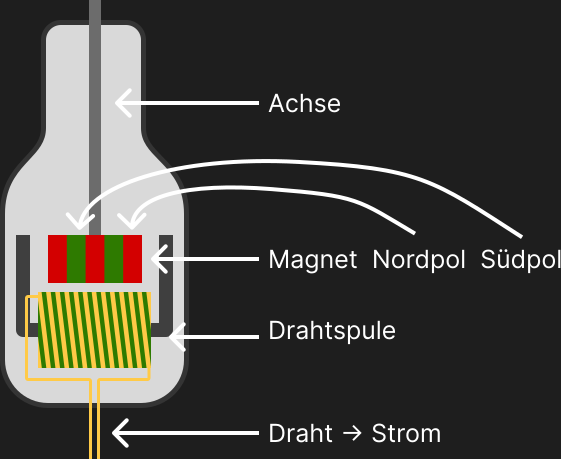

# Generatoren: Bewegungsenergie zu Elektrischem Strom

## Aufbau

## Funktionsweise

- Das Magnetfeld in der Spule ändert sich aufgrund der Bewegung des Magneten, wodurch eine Spannung induziert wird.
- Die Spannung ist abhängig von der Frequenz der Bewegung, der Anzahl der Windungen der Spule und der Stärke des Magnetfeldes.

## Anwendung

- Fahrradbeleuchtung
- Notstromversorgung
- Windkraftanlagen
- Wasserkraftwerke
